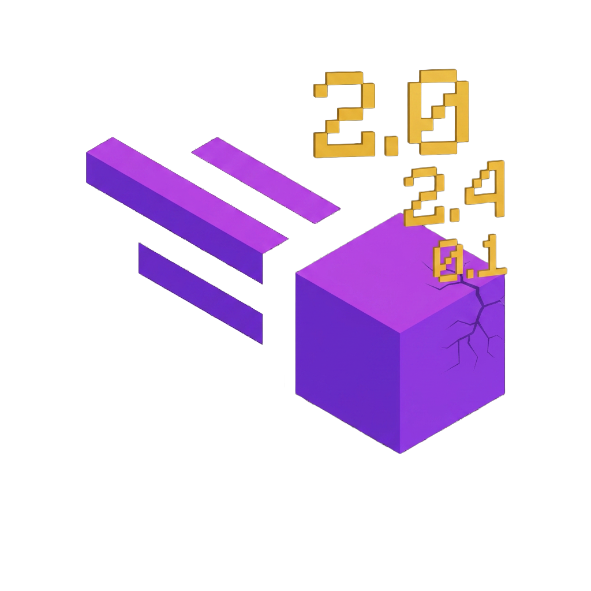

<h1>  Damage Numbers Addon</h1>

  
  
 

 

A [Meteor Client](https://github.com/MeteorDevelopment/meteor-client) addon that ports the [Damage Numbers mod](https://github.com/njlent/damagenumbers_26.1) by [luavixen](https://github.com/luavixen/damagenumbers) to Meteor.

## Download Supported version: 
- **Minecraft 26.1.2 ([latest](https://github.com/njlent/Damagenumbers-Meteor-client-addon/releases))**

## Features

Adds a Combat module named `damage-numbers` that shows floating damage text when nearby living entities take damage.

- Floating damage numbers above damaged entities.
- Optional damage numbers when the local player takes damage.
- Optional Meteor chat/text feedback for each damage number.
- Native Meteor settings for display duration and colors.
- Particle-limit behavior follows the Minecraft particle setting.

## Settings

- `show-player-damage`: show damage numbers for damage taken by you.
- `text-feedback`: print damage values to Meteor chat feedback.
- `display-ticks`: how long each number stays visible.
- `custom-colors`: use configured damage colors instead of white.
- `small-color`, `medium-color`, `large-color`, `critical-color`: color ramp matching the original mod behavior.

 
 
 

> [!IMPORTANT]
> Check out my other Meteor addons:
>
> <table>
>   <tr>
>     <td valign="middle">
>       
>     </td>
>     <td valign="middle">
>       <a href="https://github.com/njlent/Minehop-Meteor-client-addon">Minehop Addon - Source Engine-style bunnyhopping</a>
>     </td>
>   </tr>
>   <tr>
>     <td valign="middle">
>       
>     </td>
>     <td valign="middle">
>       <a href="https://github.com/njlent/Wurstmeteor-Meteor-client-addon">WurstMeteor Addon - ports selected Wurst Client features</a>
>     </td>
>   </tr>
>   <tr>
>     <td valign="middle">
>       
>     </td>
>     <td valign="middle">
>       <a href="https://github.com/njlent/Damagenumbers-Meteor-client-addon">DamageNumbers Addon - damage numbers and particles</a>
>     </td>
>   </tr>
> </table>
